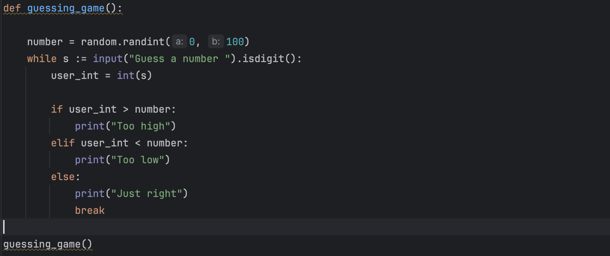
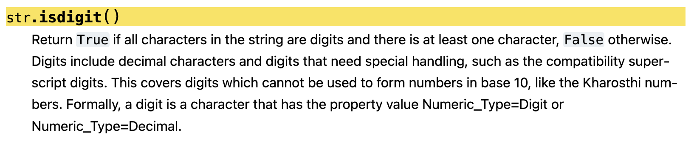

# exercise 1



- We’ll use the randint (http://mng.bz/mBEn) function in the random module to gen-

  erate a random number.

  - `random.randint`, which takes two parameters, returning a random integer.

  ```python
  import random
  number = random.randint(10, 30) # inclusive
  ```

  - Note that the maximum number in `random.randint` is inclusive. This is unusual in Python;

- We’ll also be prompting the user to enter text with the `input()` function.

  ```python
  name = input("Please enter you name.")
  print(f"Your name is {name}!")
  ```

  - The function then returns the string containing whatever the user entered;
  - If the user simply presses Enter when presented with the input prompt, the value returned by input is an empty string
  - The `input` (http://mng.bz/wB27) function always returns a string.

- In Python 3, you can’t use `<` and `>` to compare different types.
  - In Python 2, it wasn’t an error to compare objects of different types.
- *f-strings* to insert values from variables into our strings.

- Isn’t there a better way?:`While True`, 그리고 `break` 보다 좋은 방법: walrus operator

  ```python
  # It doesn't work
  while s = input("Enter your name: "):
  	print(f"Hello, {name}!")
  ```

  - That’s because assignment in Python is not an expression—that is, it doesn’t return a value. If it doesn’t return a value, then it can’t be used in a while loop.

  ```python
  # 바다코끼리(walrus) 연산자
  while s := input("Enter your name: "):
  	print(f"Hello, {name}!")
  ```

  - This version introduced the “assignment expression” operator, which looks like := (walus operator).

- If you really want to be pedantic, you can use the str.isdigit method (http://mng.bz/oPVN) to check that a string contains only digits.

  

- How, then, can you include both types in the same line of output? f-string, You can put whatever expression you want inside the curly braces, and it’ll be evaluated when the string is evaluated;

- 색다른 f-string 활용법: - You can also affect the formatting of each data type by putting a code after a colon (:) inside of the curly braces. For example, you can force the string to be aligned left or right, on a field of 10 hash marks (#)

  ```python
  name = 'world'
  first = 'Reuven'
  last = 'Lerner'
  print(f'Hello, {first:#<10} {last:#>10}')
  # Hello, Reuven#### ####Lerner
  ```

  - The format code `#<10` means that the string should be placed, left- aligned, in a field of 10 characters, with # placed wherever the word doesn’t fill it.