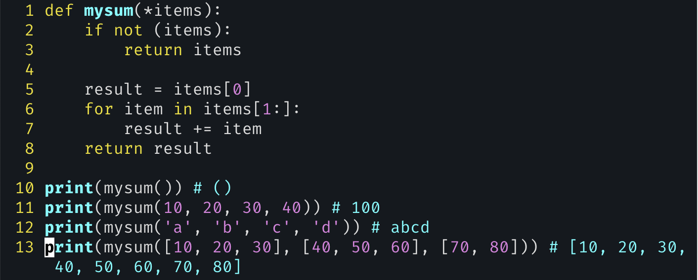

# exercise10: Summing anything

-  But for Python developers, lists are the typical go-to data type for anyone needing an array or array-like structure(하지만 Python 개발자들에게 리스트는 배열이나 배열과 유사한 구조가 필요한 사람들이 일반적으로 사용하는 데이터 타입입니다).
- lists aren’t arrays: arrays have a fixed length, as well as a type.
- how can Python use them to implement lists? The answer is that Python allocates some extra space in its list array, such that we can add a few items to it. But at a certain point, if we add enough items to our list, these spare locations will be used up, thus forcing Python to allocate a new array and move all of the pointers to that location.
  - 리스트의 확장 과정
    - python의 리스트는 내부적으로 dynamic array로 구현됨.
    - list 할당 시 요청된 크기 보다 약간 더 큰 메모리를 할당. 리스트에 새 요소 추가 시 이 여분의 공간을 사용.
    - 여분의 공간이 모두 차면, python은 더 큰 새로운 배열을 생성. 기존 요소들을 새 배열로 복사 및 새로운 요소 추가.
    - 기존 배열은 삭제
- sys.getsizeof (http://mng.bz/7Xzy), which shows the number of bytes needed to store a list (or any other data structure)
- we traditionally call the “takes any number of arguments” parameter *args, you can use any name you want. 
- slices are forgiving and allow us to specify indexes beyond the sequence’s boundaries. In such a case, we’ll just get an empty sequence, over which the for loop will run zero times.
  - python slice는 indexing 방식과 다르게 관대하다, indexing의 경우 범위를 벗어나면 IndexError를 발생시키지만, slicing의 경우 범위를 벗어나더라도 오류가 아닌 빈 시퀀스를 반환한다.