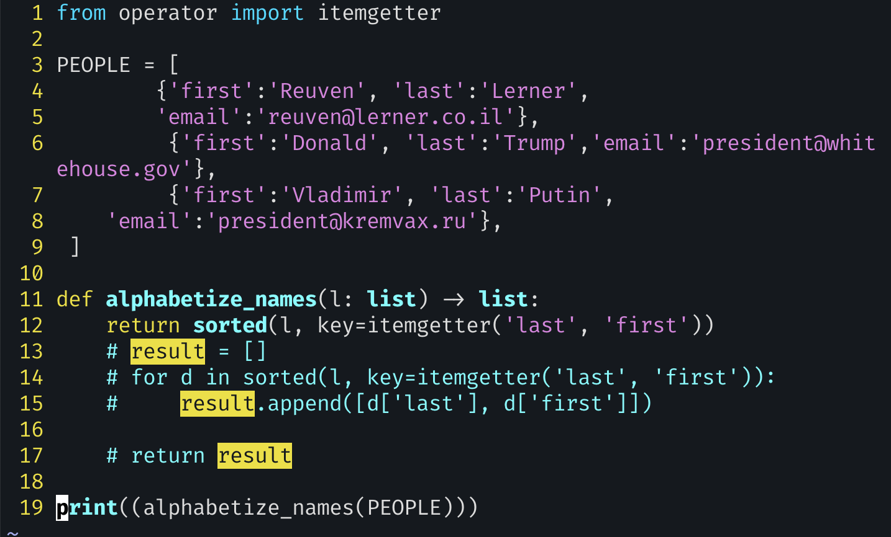
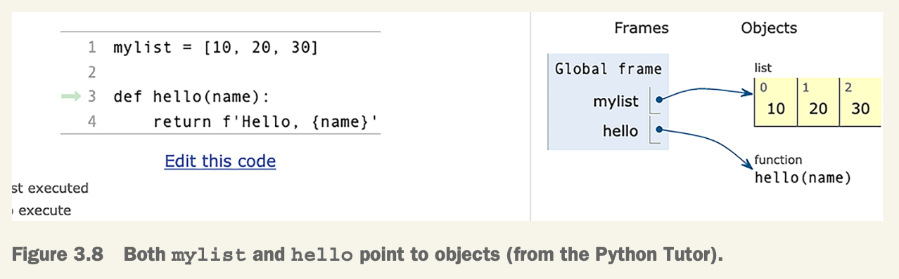

# exercise 11: Alphabetizing names



- `alphabetize_names()`: The function should return the list of dicts, but sorted by last name and then by first name.
- **Python doesn’t really have constants**; with the exception of some internal types and data structures, **every variable, function, and attribute can always be modified**. That said, variables defined outside of any function are generally referred to as “constants” and are defined in **ALL CAPS**.
- We have a list of dicts. This means that when we iterate over our list, person is assigned a dict in each iteration.
- `sorted` 함수에는 정렬의 기준이 되는 `key` parameter를 전달할 수 있다. 이 `key` parameter는 iterable의 각 element에 대하여 적용이 되는데, `len`과 같이 특정 함수를 지정하는 방법도 있고, 임시로 사용할 간단한 함수를 만들 수도 있다. 후자의 경우를 위한 인라인 함수가 바로 `lambda`이다.
  - `key`는 각 요소에 적용된다.

- **`itemgetter`**: `lambda`는 가독성이 떨어지는데, 이 문제를 해결해줄 수 있는 것이 바로 `itemgetter`

  - Fortunately, the `operator` module has the itemgetter function. `itemgetter` takes any number of arguments and returns a function that applies each of those arguments in square brackets. 여러 개의 인자를 받고, 그 인자들을 대괄호 안에 적용하는 함수를 반환

  - 또한,  C로 작성되어서 lambda보다 빠르기까지 한다.

  - 예시 코드

    ```python
    s = 'abcdef'
    t = (10, 20, 30, 40, 50, 60)
    
    # create new f using itemgetter
    get_2_and_4 = operator.itemgetter(2, 4) # index 2, 4
    
    # apply new f
    print(get_2_and_4(s))  # ('c', 'e')를 출력해
    print(get_2_and_4(t))  # (30, 50)을 출력해
    ```

- `itemgetter`에 대하여 조금 더...

  - 주어진 키나 인덱스로 아이템을 가져오는 새로운 함수를 만들어준다.

  - “호출 가능한” 객체를 반환한다는 점이 특이

  - ```python
    # using key
    person = {'name': 'Alice', 'age': 30}
    get_name = itemgetter('name') # 'name' key로 아이템을 가져오는 함수 get_name.
    print(get_name(person))  # 'Alice' 출력, person의 'name'의 값을 가져옴
    
    # using index
    numbers = [1, 2, 3, 4, 5]
    get_third = itemgetter(2) # index 2로 아이템을 가져오는 함수 get_third
    print(get_third(numbers))  # 3 출력, numbers의 index 2의 값을 가져옴
    ```

  - `get_name()`을 call 하는 것 ~ `key()`를 call하는 것


- 세 가지 방법 비교

```python
# using function
def person_dict_to_list(d):
    return [d['last'], d['first']]

for p in sorted(PEOPLE, key=person_dict_to_list):
    print(f"{p['last']}, {p['first']}")

    
# using lambda
for p in sorted(PEOPLE,
                key=lambda x: [x['last'], x['first']]):
	print(f"{p['last']}, {p['first']}")
    
# using itemgetter
from operator import itemgetter
for p in sorted(PEOPLE, 
                key=itemgetter('first', 'last'))
	print(f"{p['last']}, {p['first']}")
```


### lambda

- lambda returns a function object, allowing us to create an anonymous function. And we can use it wherever we might use a regular function, without having to “waste” a variable name.

- **Assignment in Python always means that a name is referring to an object**, and functions are objects just like anything else in Python.

- `mylist` points to an object of type list. `hello` points to a function object.

  

- Because functions are objects, they can be passed as arguments to other functions.

- we’ll want to write a function that takes another function as an argument. One such example is `sorted`.

- if I only need a function once, then why would I define it formally and give it a name? This is where lambda enters the picture; it lets us create an anonymous function, perfect for passing to other functions. It goes away, removed from memory as soon as it’s no longer needed.

- If we think of def as both (a) creating a function object and then (b) defining a variable that refers to that object, then we can think of `lambda` as doing just the first of these two tasks. That is, `lambda` creates and returns a function object.

- To create an anonymous function with lambda, use the reserved world lambda and then list any parameters before a colon. Then write the one-line expression that the lambda returns. 