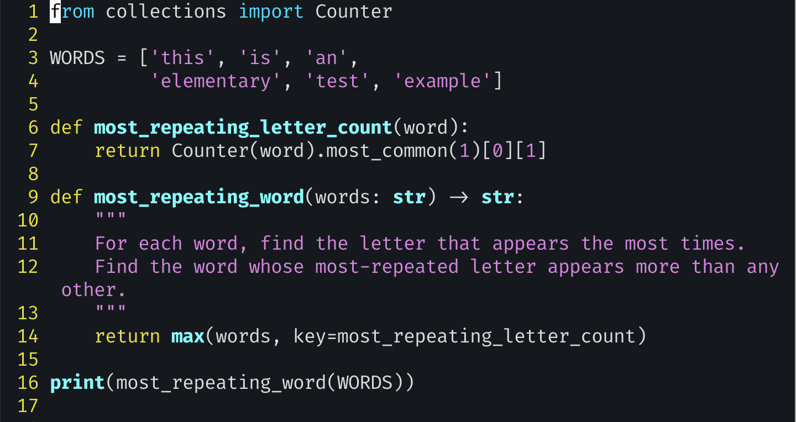
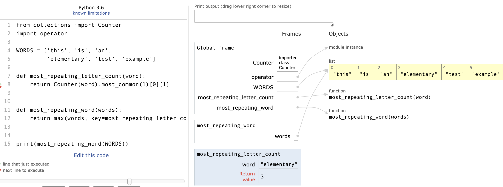

# exercise 12: Word with most repeated letters





- Write a function, most_repeating_word, that takes a sequence of strings as input.

- You’ll probably want to use Counter, from the collections module, which is per- fect for counting the number of items in a sequence.

- `Counter`, a subclass of dict defined in the collections module, which makes it easy to count things

- It’s true that `Counter` inherits from dict and thus can do anything that a dict can do. But we normally build an instance of `Counter` by initializing it on a sequence; 

  ```python
  >>> Counter('abcabcabbbc')
  Counter({'a': 3, 'b': 5, 'c': 3})
  ```

- `most_common()`: The result of invoking `Counter.most_common` is a list of tuples, with the names and values of the counter’s values in descending order.

  ```python
  >>> Counter('abcabcabbbc').most_common()
  [('b', 5), ('a', 3), ('c', 3)]
  ```

- If we were to invoke `most_common` with an integer argument n, we would only see the n most common items

  ```python
  >>> Counter('abcabcabbbc').most_common(1)
  [('b', 5)]
  ```

- `max()`도 `sorted()`처럼 정렬의 기준이 되는 key를 전달할 수 있으며 이것은 매 element 마다 호출된다.

  ```python
  from collections import Counter
  
  WORDS = ['this', 'is', 'an',
           'elementary', 'test', 'example']
  
  def most_repeating_letter_count(word):
      return Counter(word).most_common(1)[0][1]
  
  def most_repeating_word(words: str) -> str:
      """
      For each word, find the letter that appears the most times.
      Find the word whose most-repeated letter appears more than any other.
      """
      return max(words, key=most_repeating_letter_count)
  
  print(most_repeating_word(WORDS))
  ```

  