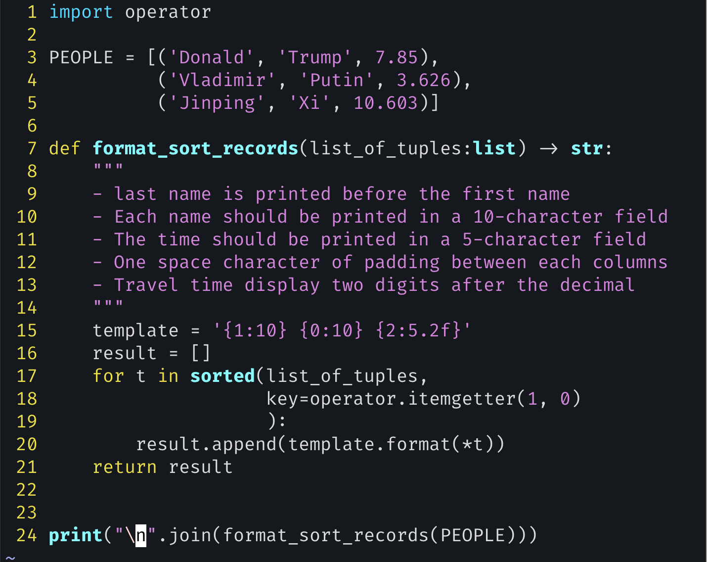

# exercise 13: Printing tuple records



- A common use for tuples is as records, those records in a table is a standard thing for programs
- We’ll do a bit of both—reading from a list of tuples and turning them into formatted output for the user.

- Write a Python function, `format_sort_records`, that takes the `PEOPLE` list and returns a formatted string

- Notice that the last name is printed before the first name. Each name should be printed in a 10-character field, and the time should be printed in a 5-character field, with one space character of padding between each of the columns. Travel time should display only two digits after the decimal point

- Tuples are often used in the context of structured data and database records.

- we needed to sort the people in alpha- betical order according to last name and first name.

- While it’s often nice to use f-strings, `str.format` (http://mng.bz/Z2eZ) can still be useful in some cir- cumstances. we’re passing three separate arguments to `str.format`, which we can access via `{0}`, `{1}`, and `{2}`.

  - `{1:10}` tells Python to display the item with index 1, inserting spaces if the data contains fewer than 10 characters. Strings are left aligned by default
  - In `str.format` (and in f-strings), each type is treated differently. So if we simply give `{2:10}` as the formatting option for our floating-point numbers (i.e., `person[2]`), the number will be right-aligned. `{2:10f}`, but that will just fill with zeros after the decimal point. The specifier for producing two digits after the decimal point, with a maximum of five digits total, would be `{5.2f}`

- `person` is a tuple, and that `*person`, when passed to a function, becomes not a tuple, but the elements of that tuple(튜플이 아닌 튜플의 요소들로 전달).

  - `*`를 사용하여 unpacking 함

- `format()`에 대한 간단한 예시

  ```python
  # 1. 기본 포맷팅
  name = "Kim"
  print('{:10}'.format(name))  # "Kim       "
  
  # 2. 인덱스 활용
  print('{1:10} {0:10}'.format('First', 'Last'))
  # "Last       First     "
  
  # 3. 소수점 포맷팅
  num = 3.141592
  print('{:.2f}'.format(num))  # "3.14"
  ```


> About `itemgetter`
>
> - 특정 index에 위치한 값을 추출하는 callable 객체를 만듬
> - lambda보다 속도가 빠르다
>
> 예시
>
> ```python
> sorted(data, key=operator.itemgetter(1, 0)) # 두 번째 요소, 첫 번째 요소 순으로 정렬
> ```
>
> 