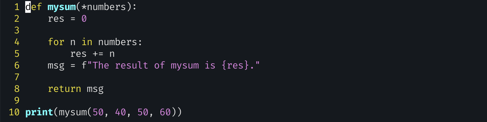

# exercise 2

- Q. The challenge here is to write a `mysum` function that does the same thing as the built-in `sum` function.
  - ex> you’d instead invoke mysum(1,2,3) or mysum(10,20,30,40,50).
- you should think about the types of parameters functions can take in Python. In Python, only one function definition (i.e., the last time that the function was defined) sticks. 마지막에 정의된 함수만이 유효함
  - If you’re not familiar with it, you’ll probably want to look into the *splat* operator (asterisk), described in this Python tutorial: http://mng.bz/aR4J.
- “splat” operator (aka `*`): to allow a function to receive any number of arguments.
  - The splat operator is especially useful when you want to receive an unknown number of arguments. Typically, you’ll expect that all of the arguments will be of the same type, although Python doesn’t enforce such a rule. cf> tuple의 형태로 받는다.
  - `*args` is an extremely common way for a function to accept an unknown number of arguments.
- This is generally true when invoking functions. If you have an iterable object and want to pass its elements to a function, just preface it with `*` in the function call
  - If we call `mysum(*[1,2,3])`, our list becomes three separate arguments, which will then allow the function to be called in the usual way.
  - unpacking이라고 불리며,  `*argus`와 반대되는 개념이다.
- The built-in version of `sum` takes an optional second argument, which is used as the starting point for the summing.
  - So `sum([1,2,3], 4)` returns 10
- 