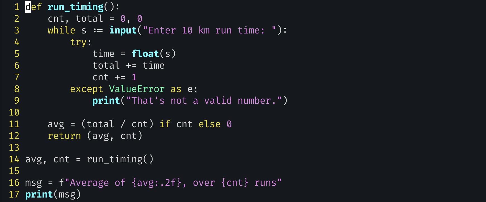
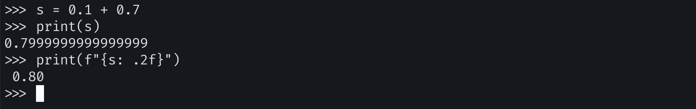

# exercise 3



- The idea of accumulating data over time is common in programs, and it’s important to see how to do this in Python.

- The user might provide two types of input; they might enter a number, but they also might enter the empty string.

  - Empty string: `False` in `if` statements

- if you’re taking input from the user and calling `float()` (http://mng.bz/gyYR), you should probably wrap it within `try` (http://mng .bz/5aY1)

  ```python
  try:
      n = float(input("Enter a number: "))
      print(f"The nuber is {n}")
  except ValueError as e:
      print("That's not a valid number")
  ```

  

- remember that floating-point numbers are not completely accurate. They’re good enough for measuring the time it takes to run, but they’re a bad idea for any sensitive measurement, such as a scientific or financial calculation.

  - One common solution for this problem is to use integers. Instead of keeping track of dollars and cents (as a `float`), you can just keep track of cents (as an `int`).

- f-string을 사용하여 float의 자릿수 지정하기

  - `: .2f`

    