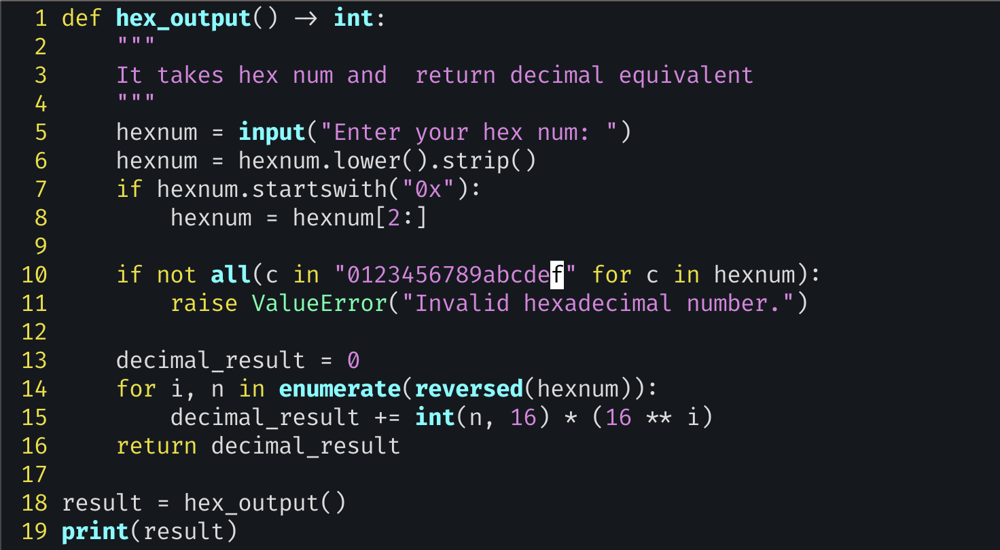

# exercise 4: Hexadecimal output

- For this exercise, you need to write a function `(hex_output)` that takes a hex number and returns the decimal equivalent.
- I could use Python’s built-in `hex()` function (http://mng .bz/nPxg) and `0x` prefix. The former takes an integer and returns a hex string; the lat- ter allows me to enter a number using hexadecimal notation
  - Thus, `0x50` is 80, and `hex(80)` will return the string `0x50`.
- A key aspect of Python strings is that they are sequences of characters, over which we can iterate in a for (http://mng.bz/vxOJ) loop.
- Why does Python have `enumerate` at all? 
  - in Python, our for loops retrieve the items directly, without needing any explicit index variable. `enumerate` thus produces the indexes based on the elements—precisely the opposite of how things work in other languages.
- `reversed`: We could get the same result using slice syntax, `hexnum[::-1]`
  - the slice returns a new string, whereas `reversed` returns an iterator, which consumes less memory.
- `int()`: `int` takes two arguments. 
  - The first is mandatory and is the string we want to turn into an integer. 
  - The second is optional and contains the number base. Since we’re converting from hexadecimal (i.e., base 16), we pass 16 as the second argument.