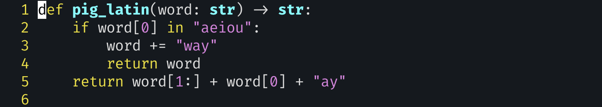
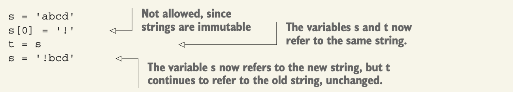

# exercise 5: Pig Latin



- You should remember two important things about Python strings: (1) they’re immutable, and (2) in Python 3, they contain Unicode characters, encoded in UTF-8.

- There’s no such thing as a “character” type in Python.

- Operator for searching in a sequence: `in`
  - ex> `'a' in 'abcd'`
- Breaks strings apart, returning a list: `str.split`
- Combines strings to create a new one: `str.join`
- Opens a file and iterates over its lines one at a time
  - ex> `for line in open(file_name):`

- The don’t repeat yourself (DRY) rule should always be at the back of your mind when writing code.
  - `in` opeerator의 필요성
- The `in` operator works on all sequences (strings, lists, and tuples) and many other Python collections. It effectively runs a `for` loop on the elements. Thus, using `in` on a `dict` will work but will only search through the keys, ignoring the values.
- slices: All of Python’s sequences—strings, lists, and tuples—support *slicing*.

- About Immutable(불변)

  - One of the most important concepts in Python is the distinction between mutable and immutable data structures.

  - 다음 코드는 실행되지 않는다(`exeption`발생). python은 문자열을 수정할 수 없다.

    ```python
    s = "aeiou"
    s[0] = "!"
    ```

  - string 뿐만 아니라, Many data structures in Python are immutable, including such basics as integers and Boolean values.

    - If strings were mutable, they wouldn’t be allowed as dict keys—or we’d have to allow for mutable keys in dicts, which would create a whole host of other issues.

  - If we share immutable data across threads, then we don’t have to worry about locking it, because it can’t be changed.

  - if we invoke a method on an immutable type, then we get a new object back—because we can’t modify immutable data.

  - 상수와의 차이점: 

    - Constants, which many programming languages offer, permanently connect a name with a value. In Python, there’s no such thing as a constant; you can always reassign a name to point to a new value. But you can’t modify a string or a tuple, no matter how hard you try;

      

