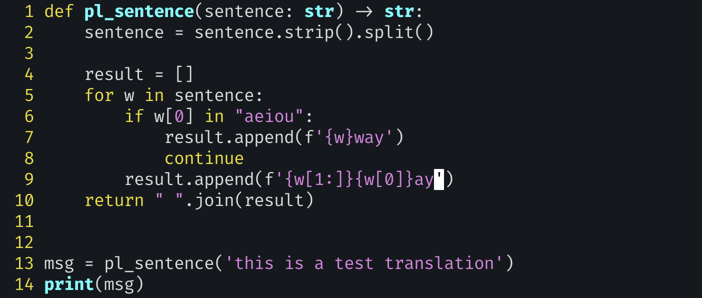

# exercise: Pig Latin sentence



- in this case, rather than treating the string as a single word, we’re treating it as a sentence—meaning that we need to sep- arate it into individual words. We can do that with `str.split` (http://mng.bz/aR4z).

- `str.split` can take an argument, which determines which string should be used as the separator between fields.

  - 인자 없이 사용할 경우 (`str.split()`, 기본적으로 모든 연속된 공백 문자(스페이스, 탭, 줄바꿈 등)를 하나의 구분자로 취급

    - 스페이스(' '), 탭('\t'), 줄바꿈('\n') 등 모든 종류의 공백 문자

    - 이러한 공백 문자들이 연속으로 나타나면, 이를 하나의 구분자로 취급

      ```python
      text = "Hello   World\t\tPython\nProgramming"
      words = text.split()
      print(words) # ['Hello', 'World', 'Python', 'Programming']
      ```

    - 만약 split(' ')와 같이 특정 공백 문자를 인자로 주면, 오직 그 문자만을 구분자로 사용하며 연속된 공백을 별도로 처리하지 않음

      ```python
      text = "Hello   World"
      print(text.split(' '))  # ['Hello', '', '', 'World']
      print(text.split())     # ['Hello', 'World']
      ```

      

  - 하지만 특정 문자나 문자열을 구분자로 사용하고 싶을 때, 그것을 인자로 전달

- It’s certainly possible to use a string for that, and to invoke += on the string with each iteration. But as a general rule, it’s not a good idea to build strings in that way. Rather, you should add elements to a list using list.append (http://mng.bz/Mdlm) and then invoke `str.join` to turn the list’s elements into a long string.

  - That’s because strings are immutable, and += on a string forces Python to create a new string. 
  - By contrast, lists are mutable, and adding to them with `list.append` is relatively inexpensive, in both memory and computation.