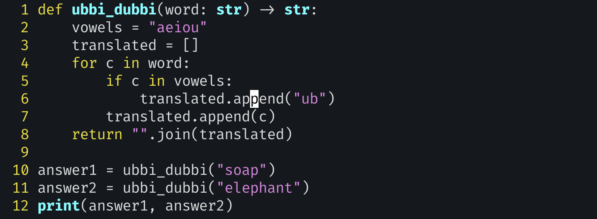

# exercise 7: Ubbi Dubbi

- Strings are immutable - if you can’t modify strings, then how can you do any serious work with them?
- we have to make sure that each modifica- tion won’t affect future modifications.

- In Ubbi Dubbi, every vowel (a, e, i, o, or u) is prefaced with ub. Thus milk becomes mubilk (m-ub-ilk) and program becomes prubogrubam (prub-ogrub-am)
- you’ll write a function (called `ubbi_dubbi`) that takes a single word (string) as an argument. It returns a string, the word’s translation into Ubbi Dubbi.

- we need to operate on a letter-by-letter basis.
- we have to avoid getting ourselves into an infinite loop, in which we try to add ub before the u in ub
- **Why append to a list, and not to a string? To avoid allocating too much memory.**