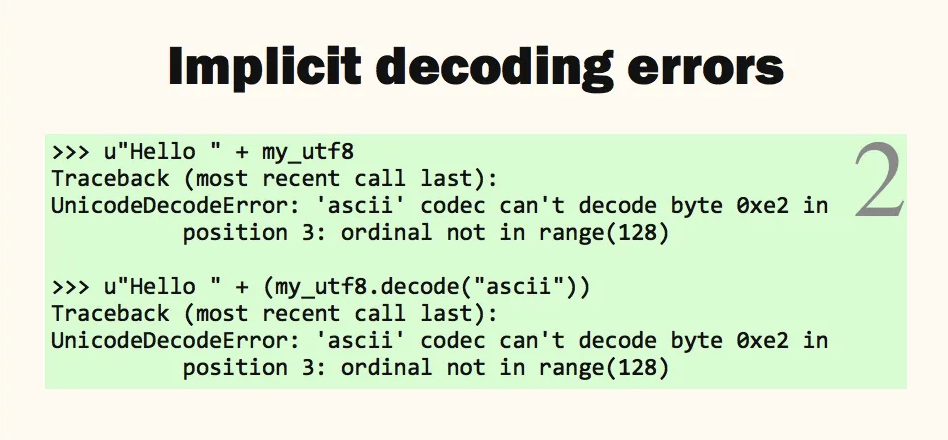

# exercise 8: Sorting a string


- Strings are immutable - we can’t change the strings themselves, but we can create new strings based on them, using a combination of built-in functions and string methods.
- `sorted()`: built-in(http://mng.bz/pBEG) function, which takes an iterable—which means not only a sequence, but anything over which we can iterate, such as a set of files—and returns its elements in sorted order. 
  - it will sort the characters in Unicode order. However, **it returns a list**, rather than a string.
  - `str.join`: To turn our list into a string(http://mng.bz/gyYl).
- Unicode
  - The idea behind Unicode is that we should be able to use computers to represent any character used in any language from any time.
    - we want to show Russian, Chinese, and English on the same page.
  - Unicode assigns each character a unique number. Thus, we have to take the Unicode character number (known as a *code point*) and translate it into a format that can be stored and transmitted as bytes.
  - Python and many other languages use what’s known as UTF-8, which is a *variable-length encod- ing*, meaning that different characters might require different numbers of bytes.


Unicode에 대한 강연(https://nedbatchelder.com/text/unipain.html)

> 대부분의 Python 프로그래머들처럼, 여러분도 이런 경험이 있을 것입니다: 멋진 애플리케이션을 만들었고, 모든 것이 순조롭게 진행되는 것 같았습니다. 그러다 어느 날 갑자기 악센트 문자가 나타났고, 여러분의 프로그램은 UnicodeErrors를 토해내기 시작했습니다.
>
> 여러분은 이러한 오류를 어떻게 다뤄야 할지 대충 알고 있었기에, 오류가 발생한 곳에 encode나 decode를 추가했습니다. 하지만 UnicodeError는 다른 곳에서 또 발생했습니다. 새로운 위치로 가서 decode를 추가하고, 어쩌면 encode도 추가했습니다. 이렇게 두더지 잡기 게임을 한동안 계속하다 보니, 문제가 해결된 것 같았습니다.
>
> - accented character: ex. ä, ö, ü 
>
> 그러나 며칠 후, 또 다른 악센트 문자가 다른 곳에 나타났고, 여러분은 문제가 완전히 해결될 때까지 다시 한 번 두더지 잡기를 해야 했습니다.
>
> - whack-a-mole: 두더지 잡기
>
> 그래서 이제 여러분은 작동하는 프로그램을 가지게 되었지만, 짜증나고 불편합니다. 너무 오래 걸렸고, 이게 "올바른" 방법이 아니라는 걸 알고 있어서 자신이 미워집니다. 그리고 Unicode에 대해 여러분이 주로 아는 것이라곤 Unicode가 싫다는 것뿐입니다.
>
> 여러분은 이상한 문자 집합에 대해 알고 싶지 않습니다. 그저 여러분을 기분 나쁘게 만들지 않는 프로그램을 작성할 수 있기를 원할 뿐입니다.
>
> 여러분은 두더지 잡기 게임을 할 필요가 없습니다. Unicode는 단순하지는 않지만, 그렇다고 어렵지도 않습니다. 지식과 규율만 있다면 Unicode를 쉽고 우아하게 다룰 수 있습니다.
>
> 제가 여러분에게 다섯 가지 인생의 진실을 가르쳐 드리고, Unicode 문제를 해결할 세 가지 전문가 팁을 제공해 드리겠습니다. 우리는 Unicode의 기초와 Python 2와 Python 3가 어떻게 작동하는지 다룰 것입니다. 이 두 버전은 다르지만, 여러분이 사용할 전략은 기본적으로 동일합니다.
>
> We’ll start with the basics of Unicode.
>
> 첫 번째 인생의 진실: 컴퓨터의 모든 것은 바이트입니다. 디스크의 파일들은 일련의 바이트이며, 네트워크 연결도 오직 바이트만을 전송합니다. 거의 예외 없이, 여러분이 작성한 모든 프로그램에 들어가고 나오는 모든 데이터는 바이트입니다.
>
> 바이트의 문제점은 그 자체로는 아무 의미가 없다는 것입니다. 우리는 바이트에 의미를 부여하기 위해 규약이 필요합니다.
>
> 텍스트를 표현하기 위해, 우리는 거의 50년 동안 ASCII 코드를 사용해 왔습니다. 각 바이트는 95개의 기호 중 하나에 할당됩니다. 제가 여러분에게 65라는 바이트를 보내면, 여러분은 그것이 대문자 A를 의미한다는 것을 알게 됩니다. 하지만 이는 오직 우리가 각 바이트가 무엇을 나타내는지에 대해 미리 합의했기 때문입니다.
>
> ISO Latin 1, or 8859-1, is ASCII extended with 96 more symbols.
>
> 
>
> Windows added 27 more symbols to produce CP1252. This is pretty much the best you can do to represent text as single bytes, because there’s not much room left to add more symbols.
>
> 이러한 문자 집합으로는 최대 256개의 문자만 표현할 수 있습니다. 하지만 인생의 진실 #2는 전 세계의 텍스트에는 256개보다 훨씬 더 많은 기호가 있다는 것입니다. 단일 바이트로는 전 세계의 텍스트를 표현할 수 없습니다. 여러분이 두더지 잡기 게임을 하느라 가장 힘들 때, 모든 사람이 영어만 사용하기를 바랐을지도 모르지만, 현실은 그렇지 않습니다. 사람들은 의사소통을 위해 많은 기호가 필요합니다.
>
> - 1바이트 = 8비트, 00000000 ~ 11111111 (256개의 상태, 0-255, 를 나타낼 수 있음)
> - ASCII는 7비트를 사용하여 128개의 문자, 확장 ASCII는 8개의 비트를 사용하여 256개의 문자를 나타냄
>
> 인생의 진실 #1과 인생의 진실 #2는 함께 우리의 컴퓨팅 기기의 구조와 전 세계 사람들의 요구 사항 사이에 근본적인 충돌을 만들어냅니다.
>
> 이 충돌을 해결하기 위한 여러 시도가 있었습니다. ASCII와 같은 단일 바이트 문자 코드는 바이트를 문자에 매핑합니다. 이들 각각은 인생의 진실 #2가 존재하지 않는 것처럼 가정합니다.
>
> 많은 단일 바이트 코드가 있지만, 이들은 문제를 해결하지 못합니다. 각각은 인간 언어의 작은 일부만을 표현하는 데 적합할 뿐입니다. 이들은 전 세계적인 텍스트 문제를 해결할 수 없습니다.
>
> - 단일 바이트 코드로는 전 세계의 다양한 문자를 포괄하는 글로벌 텍스트 문제를 해결할 수 없음
>
> 사람들은 2바이트 문자 집합을 만들려고 시도했지만, 이 역시 여전히 분절되어 있어 서로 다른 하위 집단의 사람들을 위해 서비스되었습니다. 여러 가지 표준이 존재했지만, 그래도 필요한 모든 기호를 다루기에는 여전히 충분히 크지 않았습니다.
>
> 
>
> Unicode는 기존 문자 코드의 문제를 결정적으로 해결하기 위해 설계되었습니다. Unicode는 문자에 코드 포인트라고 알려진 정수를 할당합니다. 이는 110만 개의 코드 포인트를 위한 공간을 가지고 있으며, 현재 단 11만 개만 할당되어 있어 미래의 확장을 위한 충분한 여유가 있습니다.
>
> Unicode의 목표는 모든 것을 포함하는 것입니다. ASCII로 시작하여 유명한 눈사람 기호를 포함한 수천 개의 기호를 포함하고, 세계의 모든 문자 체계를 다루며, 지속적으로 확장되고 있습니다. 예를 들어, 최신 업데이트에서는 '똥 더미(PILE OF POO)' 기호가 추가되었습니다.
>
> 
>
> 여기 6개의 특이한 Unicode 문자로 이루어진 문자열이 있습니다. Unicode 코드 포인트는 U+ 접두사와 함께 4자리, 5자리 또는 6자리의 16진수로 표기됩니다. 모든 문자는 모호하지 않은 전체 이름을 가지고 있으며, 이 이름은 항상 대문자 ASCII로 표기됩니다.
>
> 이 문자열은 "Python"이라는 단어처럼 보이도록 설계되었지만, ASCII 문자를 전혀 사용하지 않습니다.
>
> 
>
> 따라서 Unicode는 우리가 필요로 할 수 있는 모든 문자를 위한 공간을 만들어냈지만, 우리는 여전히 인생의 진실 #1을 다뤄야 합니다: 컴퓨터는 바이트를 필요로 합니다. 우리는 Unicode 코드 포인트를 저장하거나 전송하기 위해 바이트로 표현할 방법이 필요합니다.
>
> Unicode 표준은 코드 포인트를 바이트로 표현하는 여러 가지 방법을 정의합니다. 이를 인코딩이라고 합니다.
>
> 
>
> UTF-8은 Unicode의 저장과 전송을 위한 가장 인기 있는 인코딩 방식입니다. 각 코드 포인트에 대해 가변적인 수의 바이트를 사용합니다. 코드 포인트 값이 높을수록 UTF-8에서 더 많은 바이트가 필요합니다. ASCII 문자는 각각 1바이트를 사용하며, ASCII와 동일한 값을 사용하므로 ASCII는 UTF-8의 부분집합입니다.
>
> - **UTF-8**: 가변 길이(1~4바이트) 인코딩 방식, Unicode는 각 문자에 코드포인트라는 정수를 할당하는데, 이 코드포인트를 바이트로 표현하는 방법을 인코딩이라고 한다. 이러한 인코딩 방식 중 가장 인기있는 방식이다(ASCII와 호환).
>   - 코드포인트의 예시: 'A'의 코드포인트 ~> `U+0041`
>
> 여기서 우리는 특이한 문자열을 UTF-8로 표현합니다. ASCII 문자인 H와 i는 각각 1바이트이며, 다른 문자들은 코드 포인트 값에 따라 2바이트 또는 3바이트를 사용합니다. 일부 Unicode 코드 포인트는 4바이트를 필요로 하지만, 여기서는 그러한 문자를 사용하지 않습니다.
>
> - 가변 길이 인코딩: 각 코드 포인트에 1~4바이트 사용
>
> ---
>
> 좋습니다, 이론은 충분히 다뤘으니 이제 Python 2에 대해 이야기해 봅시다. 슬라이드에서 Python 2 예제들은 오른쪽 상단에 큰 숫자 2가 표시되어 있고, Python 3 예제들은 큰 숫자 3이 표시될 것입니다.
>
> 
>
> Python 2에서는 두 가지 다른 문자열 데이터 타입이 있습니다. 일반적인 문자열 리터럴은 바이트를 저장하는 "str" 객체를 제공합니다. "u" 접두사를 사용하면 코드 포인트를 저장하는 "unicode" 객체를 얻게 됩니다. unicode 문자열 리터럴에서는 백슬래시-u를 사용하여 모든 Unicode 코드 포인트를 삽입할 수 있습니다.
>
> - "str" 객체: 일반 문자열 리터럴, 바이트 저장
>
> - "unicode" 객체: "u" 접두사 사용, 코드 포인트 저장
>
> "string"이라는 단어가 문제가 될 수 있음에 주목하세요. "str"과 "unicode" 모두 문자열의 일종이며, 둘 중 하나 또는 둘 다를 "string"이라고 부르고 싶은 유혹이 있지만, 혼란을 피하기 위해 더 구체적인 용어를 사용하는 것이 좋습니다.
>
> 
>
> 바이트 문자열과 유니코드 문자열은 각각 다른 유형의 문자열로 변환하는 메서드를 가지고 있습니다. 유니코드 문자열에는 바이트를 생성하는 .encode() 메서드가 있고, 바이트 문자열에는 유니코드를 생성하는 .decode() 메서드가 있습니다. 각 메서드는 인코딩의 이름을 인수로 받습니다.
>
> - `encode()`: 유니코드 문자열 ~> 바이트 문자열
> - `decode()`: 바이트 문자열 ~> 유니코드 문자열
>
> my_unicode라는 유니코드 문자열을 정의하면 9개의 문자를 가지고 있음을 알 수 있습니다. 이를 UTF-8로 인코딩하여 my_utf8 바이트 문자열을 만들면 19바이트가 됩니다. 예상대로 UTF-8 문자열을 다시 디코딩하면 원래의 유니코드 문자열이 생성됩니다.
>
> 
>
> 안타깝게도, 데이터가 지정된 인코딩에 적합하지 않은 경우 인코딩 및 디코딩 과정에서 오류가 발생할 수 있습니다. 여기서 우리는 특수한 유니코드 문자열을 ASCII로 인코딩하려고 시도합니다. 이는 실패하는데, 그 이유는 ASCII가 0에서 127 범위의 문자만 표현할 수 있고, 우리의 유니코드 문자열에는 이 범위를 벗어나는 코드 포인트가 있기 때문입니다.
>
> 
>
> 디코딩 과정에서도 오류가 발생할 수 있습니다. 여기서는 UTF-8 문자열을 ASCII로 디코딩하려고 시도합니다. 그 결과 UnicodeDecodeError가 발생하는데, 이는 다시 한 번 ASCII가 127까지의 값만 받아들일 수 있고, 우리의 UTF-8 문자열에는 이 범위를 벗어나는 바이트가 있기 때문입니다.
>
> UTF-8조차도 모든 바이트 시퀀스를 디코딩할 수 있는 것은 아닙니다. 다음으로 무작위 데이터를 디코딩하려고 시도하면, 이 역시 UnicodeDecodeError를 발생시킵니다. 사실, UTF-8의 장점 중 하나는 유효하지 않은 바이트 시퀀스가 존재한다는 것입니다. 이는 강건한 시스템을 구축하는 데 도움이 됩니다: 데이터의 오류가 유효한 것으로 받아들여지지 않기 때문입니다.
>
> 
>
> 인코딩이나 디코딩 시, 코덱이 데이터를 처리할 수 없을 때 어떻게 할지 지정할 수 있습니다. encode나 decode 메서드의 선택적 두 번째 인자로 정책을 지정할 수 있습니다. 기본값은 "strict"로, 우리가 봤듯이 오류를 발생시킵니다.
>
> "replace" 값은 표준 대체 문자를 사용하라는 의미입니다. 인코딩 시 대체 문자는 물음표이므로, 지정된 인코딩으로 표현할 수 없는 코드 포인트는 단순히 "?"로 변환됩니다.
>
> 다른 오류 처리 방식들은 더 유용할 수 있습니다. "xmlcharrefreplace"는 HTML/XML 문자 엔티티 참조를 생성하여 \u01B4를 "ƴ"로 변환합니다 (16진수 01B4는 10진수로 436입니다). 이는 HTML 파일을 위해 유니코드를 출력해야 할 때 매우 유용합니다.
>
> 다른 오류 정책들은 각기 다른 이유로 사용됩니다. "replace"는 해석할 수 없는 데이터에 대한 방어적 메커니즘이며, 정보를 손실합니다. "xmlcharrefreplace"는 모든 원본 정보를 보존하며, XML 이스케이프가 허용되는 데이터를 출력할 때 사용됩니다.
>
> 
>
> 디코딩 시에도 오류 처리 방식을 지정할 수 있습니다. "ignore"는 제대로 디코딩할 수 없는 바이트를 무시합니다. "replace"는 문제가 있는 바이트에 대해 유니코드 U+FFFD, "REPLACEMENT CHARACTER"를 삽입합니다. 디코더가 데이터를 디코딩할 수 없기 때문에 원래 의도된 유니코드 문자의 개수를 알 수 없다는 점에 주목하세요. UTF-8 바이트를 ASCII로 디코딩하면 16개의 대체 문자가 생성되는데, 이는 디코딩할 수 없는 각 바이트에 대해 하나씩 생성된 것입니다. 반면 이 바이트들은 원래 단 6개의 유니코드 문자만을 생성하려고 했던 것입니다.
>
> 
>
> Python 2는 유니코드와 바이트 문자열을 다룰 때 도움이 되고자 합니다. 유니코드 문자열과 바이트 문자열을 결합하는 문자열 연산을 시도하면, Python 2는 자동으로 바이트 문자열을 디코딩하여 두 번째 유니코드 문자열을 생성한 다음, 두 유니코드 문자열로 연산을 완료합니다.
>
> 예를 들어, 유니코드 "Hello "와 바이트 문자열 "world"를 연결하려고 하면 결과는 유니코드 "Hello world"가 됩니다. **Python 2는 우리를 대신해 ASCII 코덱을 사용하여 바이트 문자열 "world"를 디코딩합니다.** 이러한 암묵적 디코딩에 사용되는 인코딩은 sys.getdefaultencoding()의 값입니다.
>
> 암묵적 인코딩이 ASCII인 이유는 그것이 유일하게 안전한 추측이기 때문입니다: ASCII는 매우 널리 받아들여지고 있으며, 많은 인코딩의 부분집합이기 때문에 잘못된 결과를 낼 가능성이 낮습니다.
>
> 
>
> 물론, 이러한 암묵적 디코딩이 디코딩 오류에서 완전히 자유로운 것은 아닙니다. 바이트 문자열을 유니코드 문자열과 결합하려고 할 때, 해당 바이트 문자열이 ASCII로 디코딩될 수 없다면 이 작업은 UnicodeDecodeError를 발생시킬 것입니다.
>
> 이것이 바로 그 고통스러운 UnicodeError의 원인입니다. 여러분의 코드가 의도치 않게 유니코드 문자열과 바이트 문자열을 혼합하게 되고, 데이터가 모두 ASCII인 한 암묵적 변환은 조용히 성공합니다. 하지만 일단 ASCII가 아닌 문자가 프로그램에 들어오면, 암묵적 디코드가 실패하여 UnicodeDecodeError를 일으키게 됩니다.
>
> - 특히 ASCII 범위를 벗어나는 문자를 포함할 때 문제가 발생할 수 있습니다.
> - 갑자기 비-ASCII 문자가 등장하면 오류가 발생합니다.
>
> 
>
> Python 2의 철학은 유니코드 문자열과 바이트 문자열이 혼란스러울 수 있다는 것이었고, 정수와 부동소수점 숫자 사이의 자동 변환처럼 이들 사이에서도 자동으로 변환함으로써 프로그래머의 부담을 줄이려 했습니다. 하지만 정수에서 부동소수점으로의 변환은 실패할 수 없는 반면, 바이트 문자열에서 유니코드 문자열로의 변환은 실패할 수 있습니다.
>
> Python 2는 바이트에서 유니코드로의 변환을 조용히 처리하여 ASCII를 다루는 코드를 작성하기 훨씬 쉽게 만듭니다. 하지만 그 대가로 ASCII가 아닌 데이터에 대해서는 실패하게 됩니다.
>
> - 유니코드와 바이트 문자열 사이의 자동 변환을 통해 프로그래머의 부담을 줄이고자 했습니다. 하지만, 바이트 문자열에서 유니코드로의 변환은 실패할 수 있습니다.
>
> 
>
> 두 문자열을 결합하는 방법은 많이 있으며, 이 모든 방법들은 바이트를 유니코드로 디코딩하므로 주의해야 합니다.
>
> 여기서는 ASCII 형식 문자열과 유니코드 데이터를 사용합니다. 형식 문자열은 유니코드로 디코딩된 다음 포매팅이 수행되어 결과적으로 유니코드 문자열이 됩니다.
>
> 다음으로 이 둘을 바꿔봅니다: 유니코드 형식 문자열과 바이트 문자열을 결합해도 유니코드 문자열이 생성됩니다. 이는 바이트 문자열 데이터가 ASCII로 디코딩되기 때문입니다.
>
> 심지어 유니코드 문자열을 출력하려고 시도하는 것만으로도 암묵적인 인코딩이 발생합니다: 출력은 항상 바이트이므로, 유니코드 문자열은 출력되기 전에 바이트로 인코딩되어야 합니다.
>
> 다음 예는 정말 혼란스럽습니다: 바이트 문자열을 UTF-8로 인코딩하려고 하면, ASCII로 디코딩할 수 없다는 오류가 발생합니다! 여기서의 문제는 바이트 문자열은 인코딩될 수 없다는 것입니다: 인코딩은 유니코드를 바이트로 변환하는 방법임을 기억하세요. 따라서 원하는 인코딩을 수행하기 위해 Python 2는 유니코드 문자열이 필요하고, 이를 얻기 위해 바이트를 ASCII로 암묵적으로 디코딩하려고 시도합니다.
>
> 그래서 UTF-8로 인코딩하려고 했는데, ASCII 디코딩에 대한 오류가 발생한 것입니다. 오류를 주의 깊게 살펴보는 것이 중요합니다. 오류 메시지에는 어떤 작업이 시도되었고 어떻게 실패했는지에 대한 단서가 있습니다.
>
> 마지막으로, ASCII 문자열을 UTF-8로 인코딩하는 것은 어리석습니다. 인코딩은 유니코드 문자열에 사용되어야 합니다. 이를 작동시키기 위해 Python은 동일한 암묵적 디코딩을 수행하여 인코딩할 수 있는 유니코드 문자열을 얻습니다. 하지만 문자열이 ASCII이기 때문에 성공하고, 그 다음 UTF-8로 인코딩하여 원래의 바이트 문자열을 생성합니다. ASCII가 UTF-8의 부분집합이기 때문입니다.
>
> - 바이트 문자열은 이미 인코딩된 형태이므로 다시 인코딩할 수 없습니다.
> - Python 2는 이를 해결하기 위해 먼저 바이트 문자열을 유니코드로 변환하려고 시도합니다(암묵적 디코딩).
> - Python 2의 암묵적 디코딩은 ASCII가 아닌 문자가 포함된 경우 예상치 못한 오류를 발생시킬 수 있습니다.
>
> 
>
> 이것이 가장 중요한 삶의 진리입니다: 바이트와 유니코드는 모두 중요하며, 둘 다 다룰 줄 알아야 합니다. 모든 것이 바이트라고 가정하거나 모든 것이 유니코드라고 가정할 수 없습니다. 각각을 목적에 맞게 사용해야 하며, 필요에 따라 명시적으로 서로 변환해야 합니다.
>
> ### Python3
>
> Python 2에서 유니코드로 인한 문제점들을 살펴봤으니, 이제 Python 3에서의 처리 방식을 알아보겠습니다. Python 2에서 Python 3로의 가장 큰 변화는 유니코드 처리 방식입니다.
>
> 
>
> Python 2와 마찬가지로 Python 3에도 두 가지 문자열 타입이 있습니다. 하나는 유니코드용이고 다른 하나는 바이트용입니다. 하지만 이들의 이름이 다르게 변경되었습니다.
>
> 이제 일반 문자열 리터럴로 얻는 "str" 타입은 유니코드를 저장하고, "bytes" 타입은 바이트를 저장합니다. 'b' 접두사를 사용하여 바이트 리터럴을 만들 수 있습니다.
>
> 따라서 Python 2의 "str"은 이제 "bytes"로 불리고, Python 2의 "unicode"는 이제 "str"로 불립니다. 이는 Python 2의 이름보다 더 합리적입니다. 모든 텍스트는 유니코드로 저장하는 것이 바람직하고, 바이트 문자열은 실제로 바이트를 다룰 때만 사용하기 때문입니다.
>
> - Python 2: 기본 문자열 타입은 바이트 문자열(str)이었습니다.
>
> - Python 3: 기본 문자열 타입은 유니코드 문자열(str)입니다. 바이트 문자열은 별도의 bytes 타입으로 존재합니다.
>
> - Python 2: 'hello'는 바이트 문자열, u'hello'는 유니코드 문자열이었습니다.
>
> - Python 3: 'hello'는 유니코드 문자열, b'hello'는 바이트 문자열입니다.
>
> - Python 2: 파일 입출력은 기본적으로 바이트로 처리되었습니다.
>
> - Python 3: 텍스트 모드의 파일 입출력은 기본적으로 유니코드로 처리됩니다.
>
> 
>
> ```python
> # Python 2: 암묵적으로 바이트 문자열을 ASCII로 디코딩하여 유니코드와 비교
> print u"hello" == "hello"  # True
> print u"안녕" == "안녕"    # False (non-ASCII characters)
> ```
>
> Python 3에서 유니코드 지원의 가장 큰 변화는 바이트 문자열의 자동 디코딩이 없어졌다는 것입니다. 바이트 문자열과 유니코드 문자열을 결합하려고 하면, 데이터와 관계없이 항상 오류가 발생합니다!
>
> Python 2에서 바이트 문자열을 유니코드 문자열로 자동 변환하여 완료했던 모든 작업들이 Python 3에서는 오류를 발생시킵니다.
>
> 또한, Python 2에서는 유니코드 문자열과 바이트 문자열이 동일한 ASCII 바이트를 포함하고 있으면 같다고 간주했지만, Python 3에서는 그렇지 않습니다. 이로 인해 Python 2에서는 가능했던, 유니코드 딕셔너리 키를 바이트 문자열로 찾거나 그 반대의 경우가 Python 3에서는 불가능합니다.
>
> 
>
> 이는 Python 3에서 유니코드 관련 문제의 성격을 극적으로 변화시켰습니다. Python 2에서는 ASCII 데이터만 사용하는 한 유니코드와 바이트를 혼합해도 성공했습니다. 반면 Python 3에서는 데이터와 관계없이 즉시 실패합니다.
>
> 따라서 Python 2의 문제는 지연됩니다: 프로그램이 정상이라고 생각하다가 나중에 특수 문자를 다룰 때 실패한다는 것을 알게 됩니다. Python 3에서는 코드가 즉시 실패하므로, ASCII만 다루더라도 바이트와 유니코드의 차이를 명시적으로 처리해야 합니다.
>
> Python 3는 바이트와 유니코드의 차이를 엄격하게 구분합니다. 코드에서 어떤 것을 다루고 있는지 명확히 해야 합니다. 이는 논란의 여지가 있으며 어려움을 겪을 수 있습니다.
>
> 
>
> 이러한 새로운 엄격성으로 인해 Python 3에서는 파일을 읽는 방식이 변경되었습니다. Python은 항상 파일을 읽는 두 가지 모드를 가지고 있었습니다: 바이너리 모드와 텍스트 모드입니다. Python 2에서는 이 차이가 단지 줄 끝 문자에만 영향을 미쳤고, Unix 플랫폼에서는 이마저도 실질적인 차이가 없었습니다.
>
> Python 3에서는 이 두 모드가 서로 다른 결과를 생성합니다. "r" 모드로 또는 모드를 지정하지 않고 기본값으로 파일을 텍스트 모드로 열면, 파일에서 읽은 데이터는 암묵적으로 유니코드로 디코딩되어 str 객체로 반환됩니다.
>
> 파일을 "rb"로 바이너리 모드로 열면, 파일에서 읽은 데이터는 어떠한 처리도 되지 않은 bytes 객체로 반환됩니다.
>
> - 텍스트 모드 ("r"): str 객체 반환, 바이너리 모드 ("rb"): bytes 객체 반환
>
> - 텍스트 파일을 다룰 때는 텍스트 모드를 사용해야 합니다. 이미지, 오디오 등의 바이너리 파일은 바이너리 모드로 열어야 합니다.
> - 텍스트 모드에서 파일을 열 때 명시적으로 인코딩을 지정할 수 있습니다. 예: `open('file.txt', 'r', encoding='utf-8')`
>
> 바이트에서 유니코드로의 암묵적 변환은 `locale.getpreferredencoding()`이 반환하는 인코딩을 사용하며, 이는 예상과 다른 결과를 줄 수 있습니다. 예를 들어, hi_utf8.txt 파일을 읽을 때, 로케일의 선호 인코딩을 사용하여 디코딩됩니다. 이 샘플들을 Windows에서 만들었기 때문에, 이 경우 "cp1252"입니다. ISO 8859-1과 마찬가지로 CP-1252는 모든 바이트 값을 허용하는 1바이트 문자 코드이므로 UnicodeDecodeError를 절대 발생시키지 않습니다. 이는 또한 실제로 CP-1252가 아닌 데이터도 문제없이 디코딩하여 의미 없는 결과를 만들어낼 수 있다는 뜻입니다.
>
> 파일을 올바르게 읽기 위해서는 사용할 인코딩을 명시해야 합니다. open() 함수는 이제 선택적인 encoding 매개변수를 가지고 있습니다.
>
> - locale.getpreferredencoding()은 시스템의 기본 인코딩을 반환합니다.
> - 이는 플랫폼과 설정에 따라 다를 수 있어, 일관성 없는 결과를 초래할 수 있습니다.
>
> ### Pain relief
>
> OK, so how do we deal with all this pain? The good news is that the rules to remember are simple, and they’re the same for Python 2 and Python 3.
>
> 
>
> 우리가 첫 번째 삶의 진리에서 봤듯이, 프로그램으로 들어오고 나가는 데이터는 반드시 바이트여야 합니다. 하지만 프로그램 내부에서는 바이트를 다룰 필요가 없습니다. 가장 좋은 전략은 들어오는 바이트를 최대한 빨리 디코딩하여 유니코드로 만드는 것입니다. 프로그램 전체에서 유니코드를 사용하다가, 데이터를 출력할 때 가능한 늦게 바이트로 인코딩하는 것입니다.
>
> 이는 유니코드 샌드위치를 만듭니다: 바깥쪽은 바이트, 안쪽은 유니코드입니다.
>
> 때로는 사용하는 라이브러리가 이러한 변환 중 일부를 대신 처리해줄 수 있다는 점을 명심하세요. 라이브러리가 유니코드 입력을 제공하거나 출력을 위해 유니코드를 받아들이고, 라이브러리가 바이트와의 경계 변환을 처리할 수 있습니다. 예를 들어, Django는 유니코드를 제공하며, json 모듈도 마찬가지입니다.
>
> 
>
> 
>
> 두 번째 규칙은 여러분이 다루고 있는 데이터의 종류를 알아야 한다는 것입니다. 프로그램의 어느 지점에서든, 여러분이 바이트 문자열을 다루고 있는지 유니코드 문자열을 다루고 있는지 알아야 합니다. 이는 추측의 문제가 아니라 설계의 문제여야 합니다.
>
> 또한, 바이트 문자열을 다루고 있다면, 그것을 텍스트로 다룰 의도가 있는 경우 어떤 인코딩인지 알아야 합니다.
>
> 코드를 디버깅할 때, 단순히 값을 출력해서 그것이 무엇인지 알아낼 수 없습니다. 타입을 확인해야 하며, 어떤 데이터를 가지고 있는지 정확히 알아내기 위해 값의 repr을 확인해야 할 수도 있습니다.
>
> - 바이트 문자열을 텍스트로 해석하려면 그 인코딩을 알아야 합니다.
>
> 
>
> 제가 말씀드린 대로, 여러분은 바이트 문자열의 인코딩이 무엇인지 이해해야 합니다. 여기 네 번째 삶의 진리가 있습니다: 바이트 문자열을 검사하는 것만으로는 그 인코딩을 결정할 수 없습니다. 다른 수단을 통해 알아야 합니다. 예를 들어, 많은 프로토콜들은 인코딩을 명시하는 방법을 포함하고 있습니다. 여기 HTTP, HTML, XML, 그리고 Python 소스 파일의 예시가 있습니다. 또한 사전 약속을 통해 인코딩을 알 수도 있습니다. 예를 들어, 데이터 소스의 명세서가 인코딩을 지정할 수 있습니다.
>
> 바이트의 인코딩을 추측하는 방법들이 있지만, 그것들은 단지 추측일 뿐입니다. 인코딩을 확실히 알 수 있는 유일한 방법은 다른 방식으로 찾아내는 것입니다.
>
> 
>
> 
>
> 여기 우리의 특별한 유니코드 문자열이 UTF-8로 인코딩된 다음, 실수로 다양한 인코딩으로 디코딩되는 예시가 있습니다. 보시다시피, 잘못된 인코딩으로 디코딩하면 성공할 수는 있지만 잘못된 문자들이 생성됩니다. 프로그램은 잘못 디코딩하고 있다는 것을 알아채지 못하며, 오직 사람들이 그 텍스트를 읽으려고 할 때만 무언가 잘못되었다는 것을 알 수 있습니다.
>
> 이는 네 번째 삶의 진리를 잘 보여주는 예시입니다: 같은 바이트 스트림이 여러 다른 인코딩을 사용해 디코딩될 수 있습니다. 바이트 자체로는 어떤 인코딩을 사용하는지 나타내지 않습니다.
>
> 참고로, 이런 깨진 문자 표시에 대한 용어가 있습니다. 오랫동안 이 문제를 다뤄온 일본어에서 온 '모지바케(Mojibake)'라는 용어입니다.
>
> - UTF-8로 인코딩된 텍스트를 다른 인코딩(예: ASCII, ISO-8859-1, CP1252 등)으로 디코딩하면 잘못된 결과가 나옵니다. 이는 같은 바이트 값이 다른 인코딩에서 다른 의미를 가지기 때문입니다.
>
> 
>
> 안타깝게도, 바이트의 인코딩이 바이트 자체와는 별도로 전달되어야 하기 때문에, 때때로 지정된 인코딩이 잘못될 수 있습니다. 예를 들어, 웹 서버에서 HTML 페이지를 가져올 때 HTTP 헤더는 페이지가 8859-1로 인코딩되었다고 주장할 수 있지만, 실제로는 UTF-8로 인코딩되어 있을 수 있습니다.
>
> 일부 경우에는 인코딩 불일치가 성공하지만 모지바케(깨진 문자)를 야기할 수 있습니다. 다른 경우에는 인코딩이 바이트에 대해 유효하지 않아 어떤 종류의 UnicodeError를 발생시킬 수 있습니다.
>
> ```python
> # UTF-8로 인코딩된 데이터
> utf8_bytes = "안녕하세요".encode('utf-8')
> 
> # 잘못된 인코딩으로 디코딩 (모지바케 발생)
> print(utf8_bytes.decode('iso-8859-1'))  # 안녕하세ìš"
> 
> # 유효하지 않은 인코딩으로 디코딩 시도 (UnicodeError 발생)
> try:
>     print(utf8_bytes.decode('ascii'))
> except UnicodeError as e:
>     print(f"Error: {e}")
> ```
>
> 
>
> 말할 필요도 없이, 여러분은 유니코드 지원을 명시적으로 테스트해야 합니다. 이를 위해서는 여러분의 코드를 통과시킬 수 있는 도전적인 유니코드 데이터가 필요합니다. 영어만 사용하는 사람이라면 이를 수행하는 데 문제가 있을 수 있습니다. 많은 비 ASCII 데이터를 읽기 어렵기 때문입니다. 다행히도 다양한 유니코드 코드 포인트는 영어 사용자도 읽을 수 있는 복잡한 유니코드 문자열을 구성할 수 있게 해줍니다.
>
> 여기 과도하게 억양이 있는 텍스트, 읽을 수 있는 의사 ASCII 텍스트, 그리고 거꾸로 된 텍스트의 예시가 있습니다. 이런 종류의 문자열을 얻을 수 있는 좋은 출처 중 하나는 십대들이 소셜 네트워킹 사이트에 붙여넣을 수 있는 문자열을 제공하는 다양한 웹사이트들입니다.
>
> - 특히 국제 시장을 대상으로 하는 소프트웨어 개발 시 이러한 테스트는 필수적입니다. 
>
> 
>
> To review, these are the five unavoidable Facts of Life:
>
> 1. All input and output of your program is bytes(프로그램의 모든 입력과 출력은 바이트입니다.).
>    - 컴퓨터 시스템의 가장 기본적인 수준에서 모든 데이터는 바이트로 처리됩니다. 파일 I/O, 네트워크 통신 등 모든 외부와의 상호작용은 바이트 단위로 이루어집니다.
> 2. The world needs more than 256 symbols to communicate text.
>    - ASCII의 256개 문자로는 세계의 모든 언어와 기호를 표현하기에 부족합니다. ~> 유니코드의 필요성
> 3. Your program has to deal with both bytes and Unicode.
>    - 외부와의 통신에는 바이트가 필요하지만, 텍스트 처리를 위해서는 유니코드가 필요합니다.
> 4. A stream of bytes can’t tell you its encoding.
>    - 동일한 바이트 시퀀스가 다른 인코딩에서 다른 의미를 가질 수 있기 때문에, 바이트만으로는 어떤 인코딩을 사용했는지 확실히 알 수 없습니다.
> 5. Encoding specifications can be wrong.
>    - 데이터와 함께 제공되는 인코딩 정보가 실제 데이터의 인코딩과 일치하지 않을 수 있습니다. 이는 잘못된 설정, 레거시 시스템, 사용자 오류 등으로 인해 발생할 수 있습니다.
>
> 
>
> 소프트웨어를 개발할 때 코드를 유니코드에 적합하게 유지하기 위해 명심해야 할 세 가지 프로 팁:
>
> 1. 유니코드 샌드위치: 프로그램 내의 모든 텍스트를 유니코드로 유지하고, 가능한 한 경계에 가깝게 변환하세요.
>
>    - 프로그램의 외부 경계에서만 인코딩/디코딩을 수행하고, 내부에서는 항상 유니코드를 사용합니다.
>
>    - ```python
>      # 입력 (바이트) -> 디코딩 -> 처리 (유니코드) -> 인코딩 -> 출력 (바이트)
>      input_bytes = get_input()
>      text = input_bytes.decode('utf-8')
>      processed_text = process(text)
>      output_bytes = processed_text.encode('utf-8')
>      send_output(output_bytes)
>      ```
>
> 2. 문자열의 성질을 파악하세요: 어떤 문자열이 유니코드이고, 어떤 것이 바이트인지, 그리고 바이트 문자열의 경우 어떤 인코딩을 사용하는지 설명할 수 있어야 합니다.
>
> 3. 유니코드 지원을 테스트하세요. 모든 경우를 다루고 있는지 확인하기 위해 테스트 스위트 전체에 걸쳐 특이한 문자열을 사용하세요.
>
> 이러한 팁들을 따르면, 유니코드를 잘 다루는 견고한 코드를 작성할 수 있으며, 아무리 특이한 유니코드를 만나더라도 무너지지 않을 것입니다.

