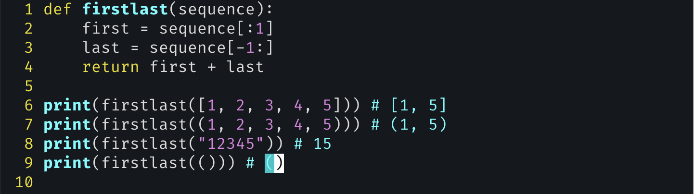
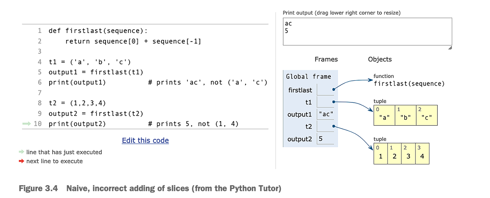

# exercise 9: First-Last

- List와 tuple
  - list는 mutable이며, 서로 다른 타입의 데이터를 저장하기에 적합하다
  - tuple은 imputable이며, 서로 같은 타입의 데이터를 저장하기에 적합
- We’ll want to display, search through, extend, and modify this information.
  - 이것에 가장 적합한 data structure는 *collections*, which is designed for handling such cases. Lists and tuples are Python’s built-in collections.
- lists are mutable, whereas tuples are immutable.
- lists are meant to be used for sequences of the same type, whereas tuples are meant for sequences of different types.
- Lists and tuples are both Python *sequences*, which means that we can run `for` loops on them, search using the `in` operator, and retrieve from them, both using individual indexes and with slices.
- *list comprehensions*, which allows us to take one Python iterable and create a new list based on it.
  - ~> Returns a list based on an iterable
  - `str(x) for x in [10, 20, 30]`
- In Python, you can write a single function that works with many types, rather than many nearly identical functions, each for a specific type. Such functions demonstrate the elegance and power of dynamic typing.
- Write a function, firstlast, that takes a sequence (string, list, or tuple) and returns the first and last elements of that sequence, in a two-element sequence of the same type.

- we don’t need to define several different versions of firstlast, each handling a different type. Rather, we can define a single function that handles not only the built-in sequences, but also any new types we might define that can handle indexes and slices.
- slicing vs indexing
  1. slicing은 항상 원래 객체와 같은 타입의 새로운 객체를 반환한다(타입 일관성 보장)
  2. indexing은 원래 객체의 타입과 다른 탕입의 객체를 반환할 수 있다.
     - 인덱싱에서 반환되는 객체의 타입은 시퀀스 내에 저장된 요소의 타입에 따라 결정

- When you retrieve a single element from a sequence (figure 3.1), you can get any type at all. String indexes return one-character strings, but lists and tuples can contain anything. By contrast, when you use a slice, you’re guaranteed to get the same type back—so a slice of a tuple is a tuple, regardless of the size of the slice or the elements it contains. And a slice of a list will return a list.

